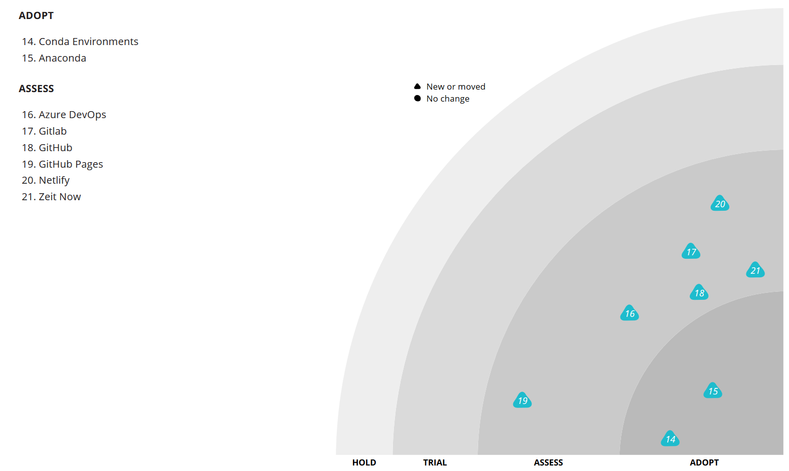
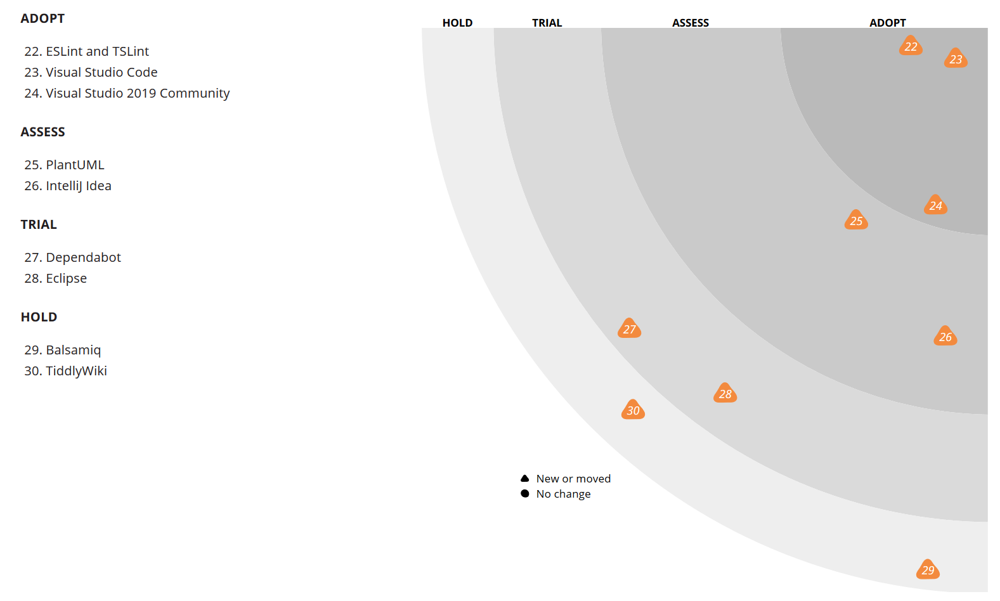
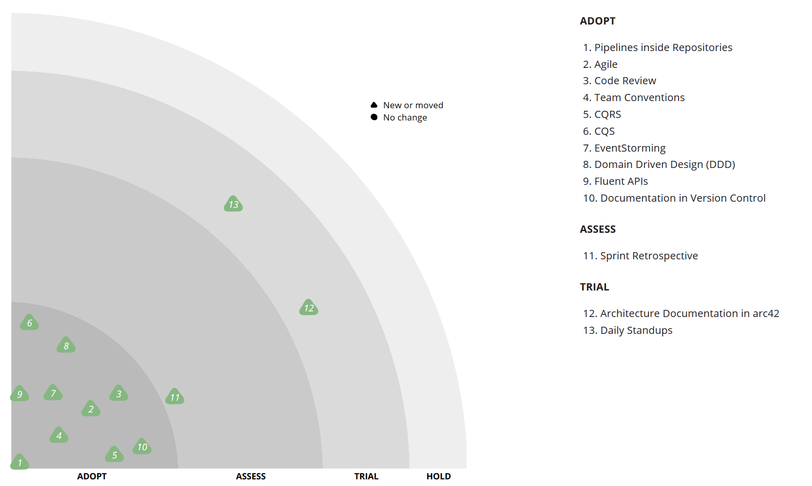
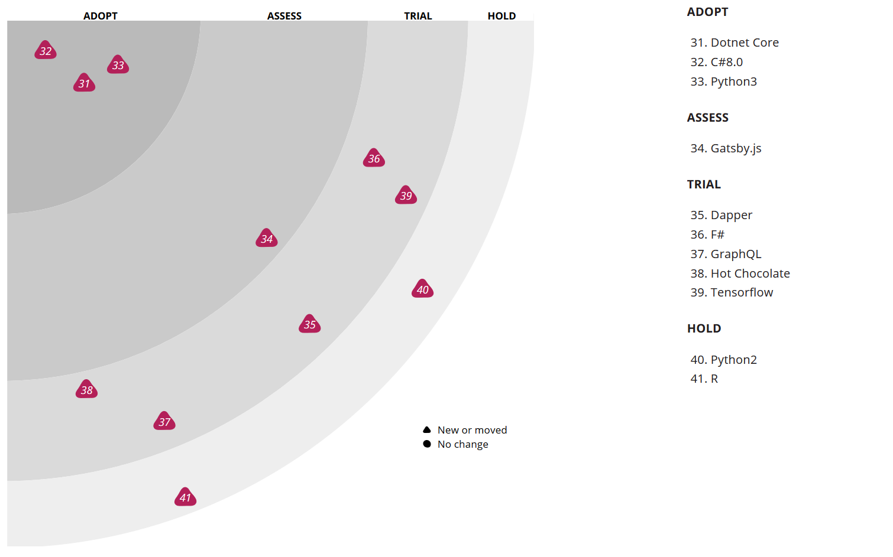

After some time thinking about tools and techniques on my own, I have decided to take the first step and create my own personal tech radar. I am still not quite convinced with using the server from Thoughtworks for this, but for the time being it will have to do.

It is still work in progress, but ready to be used. The current version of the radar (for April 2020) can be seen [here](https://radar.thoughtworks.com/?sheetId=https%3A%2F%2Fraw.githubusercontent.com%2Fmarsop%2Ftechradar%2Fmaster%2FAlberto%2520Gregorio%27s%2520Tech%2520Radar%25202020-04.csv).

As always, the opinions are my own, but suggestions are appreciated.

## Platforms

## Tools

## Techniques

## Languages and Frameworks

